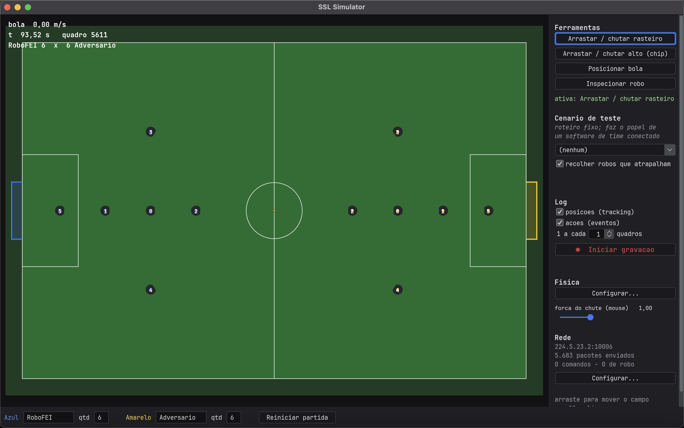
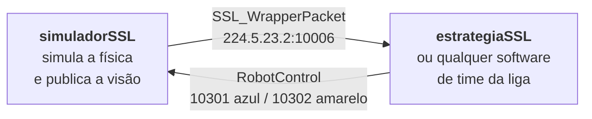
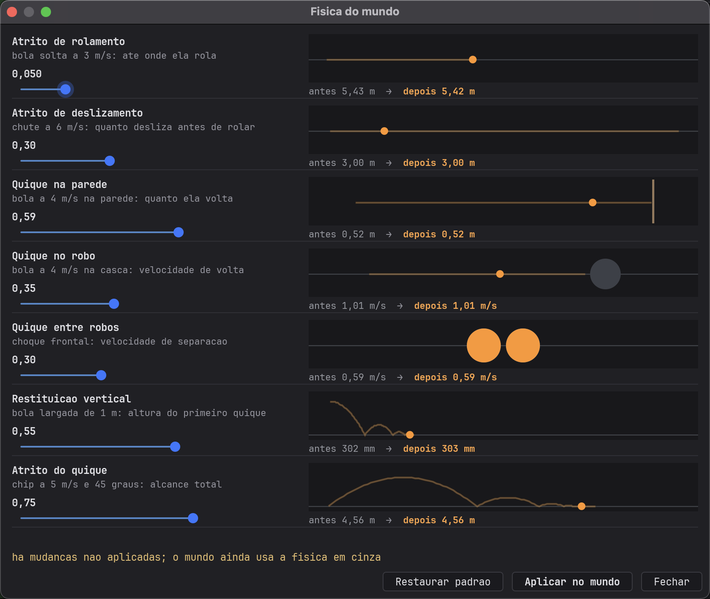

# Guia do simuladorSSL

Este é o guia de **uso**: como rodar, como mexer e o que fazer quando algo não funciona.

Para saber **por que** cada decisão de projeto é o que é, ou seja, por que o atrito tem duas
fases, por que a colisão usa velocidade relativa e por que a física precisa ser independente de
`dt`, o lugar é o [README](README.md). Os dois textos têm leitores diferentes de propósito.

**Entre por onde faz sentido para você:**

| se você… | vá para |
|---|---|
| nunca rodou isso | [Primeira vez](#primeira-vez) |
| quer entender o que é, sem instalar | [O que é isso](#o-que-é-isso) |
| vai usar na bancada | [Bancada](#bancada) |
| quer gerar dataset | [Modo headless](#modo-headless) |

---

## O que é isso

Um simulador 2D de futebol de robôs da categoria [RoboCup SSL](https://ssl.robocup.org/), no
mesmo papel do **grSim**: ele simula a física do campo e **publica a visão** na rede, pelo
protocolo oficial da liga.



Ele **não tem lógica de jogo nenhuma**. Sem um software de time conectado, os robôs ficam
parados, e isso está certo, porque é como o grSim se comporta. Quem decide o que os robôs fazem é o
repositório irmão, [estrategiaSSL](https://github.com/nThzzzz/estrategiaSSL).



Como a conversa é o **protocolo oficial**, e não uma chamada de função, qualquer software de
time da liga funciona no lugar do nosso, e o nosso funciona contra o grSim sem trocar uma
linha.

### O que ele sabe e não conta

O simulador conhece a velocidade de cada robô, o comando que aplicou e quem está com a bola. Ele
**não manda nada disso**, porque o protocolo da visão não tem campo para essas coisas: por robô
vão só `x`, `y`, `orientation` e a confiança.

Essa assimetria é de propósito. Se o simulador mandasse a verdade interna, a estratégia
funcionaria na bancada e quebraria na competição, onde quem enxerga é a `ssl-vision` com câmeras
no teto. O que o simulador sabe a mais vai para o **log**, que é onde serve para alguma coisa.

---

## Primeira vez

### O que você precisa

- **Java 22 ou mais novo** (`java -version` para conferir). Sem Gradle, sem Maven.
- **Git**.

Os `.jar` estão versionados em `lib/` e o Java gerado dos `.proto` em `src/proto/`, então um
clone limpo compila **offline**.

### Rodando

```bash
git clone https://github.com/nThzzzz/simuladorSSL.git
cd simuladorSSL
./tools/build.sh
java -cp "out/production/SSL:lib/*" Main
```

Abre a janela com o campo, 6 robôs de cada lado e a visão já publicando. O painel da direita, em
**Rede**, mostra o contador de pacotes subindo.

Para brincar sem tocar na rede:

```bash
java -cp "out/production/SSL:lib/*" Main --sem-rede
```

### Fazendo alguma coisa acontecer

Os robôs ficam parados até alguém conectar. Duas formas de ver movimento sem escrever código:

**1. Um cenário de teste.** No painel da direita, em *Cenario de teste*, escolha um roteiro. Ele
faz o papel de um software de time conectado:

| cenário | o que faz |
|---|---|
| `chute-no-gol` | um robô busca a bola e chuta ao gol |
| `passe-com-chip` | passe por cima, com a bola saindo do chão |
| `conducao-com-roller` | condução com o dribbler ligado |

**2. Com a mão.** As ferramentas do painel:

| ferramenta | como usar |
|---|---|
| **Arrastar / chutar rasteiro** | arraste a partir da bola; o vetor mostra a velocidade em m/s |
| **Arrastar / chutar alto (chip)** | o mesmo, mas a bola sai a 45° e quica |
| **Posicionar bola** | clique para teleportar a bola |
| **Inspecionar robo** | clique num robô para ver seu estado |

Ao mirar, o vetor fica **vermelho ao saturar** nos 6,5 m/s. Sem isso não dá para dosar a força,
porque o comprimento do vetor sozinho não diz nada depois que bate no teto.

### Na tela

| gesto | efeito |
|---|---|
| scroll | zoom, ancorado no cursor |
| arrastar | move o campo |

O painel **Tela**, no fim da coluna, controla a taxa de redesenho. Em zero, que é o padrão, ele
pergunta ao monitor e usa a taxa dele, então num monitor de 144 ou 165 Hz a janela deixa de
ficar presa em 60.

**Isso não afeta a física.** O relógio da tela só chama um acumulador de passo fixo: a simulação
roda sempre em `dt`, e desenhar mais vezes só faz o acumulador devolver zero mais vezes. Existe
como ajuste porque 165 Hz gasta CPU, e num notebook na bateria isso pesa mais do que a suavidade
ganha.

---

## Ajustando a física

O botão **Configurar…** do painel *Fisica* abre a janela de ajuste. Cada parâmetro tem uma
**prévia animada** que mostra o que ele significa, e um número de antes/depois:



A prévia existe porque "restituição vertical = 0,55" não diz nada a ninguém. "Bola largada de
1 m quica até 303 mm" diz. O número em laranja é o efeito do valor que você está mexendo; o
cinza é o que o mundo ainda está usando, até você clicar em **Aplicar no mundo**.

> A física é **independente de `dt`**: a mesma trajetória sai a 60 Hz e a 600 Hz. Isso é
> verificado por teste e é a condição para o log valer alguma coisa. Se você mexer no motor,
> mantenha essa verificação passando.

---

## Modo headless

Para gerar dataset, sem janela e sem rede:

```bash
java -cp "out/production/SSL:lib/*" Main \
     --headless --cenario chute-no-gol --duracao 300 --saida logs/c1
```

Roda centenas de vezes mais rápido que o tempo real. Ele **não publica** de propósito: nessa
velocidade inundaria o multicast.

A saída é um diretório com o tracking (`ball.csv`, `robots.csv`) e os eventos
(`events.jsonl`). O log carrega o que o protocolo da visão não tem campo para mandar, que são
velocidade, comando aplicado e posse de bola, e é justamente isso que torna o dataset útil para
conferir uma inferência contra a verdade.

| flag | efeito |
|---|---|
| `--duracao <s>` | tempo simulado (padrão 60) |
| `--dt <s>` | passo de física (padrão 1/60) |
| `--robos <n>` | robôs por equipe (padrão 6) |
| `--saida <dir>` | diretório de saída (padrão `logs/<timestamp>`) |
| `--log-intervalo <n>` | grava 1 a cada n quadros |
| `--sem-log`, `--sem-tracking`, `--sem-eventos` | omitem partes da saída |

---

## Bancada

### Comandos

```bash
./tools/build.sh                                          # compila tudo

java -cp "out/production/SSL:lib/*" Main                  # janela + publica visão
java -cp "out/production/SSL:lib/*" Main --sem-rede       # janela, sem tocar na rede
java -cp "out/production/SSL:lib/*" Main --ajuda          # todas as opções

java -cp "out/production/SSL:lib/*" teste.Autoteste       # física, colisão, arquitetura
java -cp "out/production/SSL:lib/*" teste.AutotesteRede   # protocolo, por sockets reais
```

Os testes não usam framework: são `main()` que imprimem `ok`/`FALHA` por verificação e saem com
código diferente de zero se algo quebrar.

### Portas

| | direção | endereço | mensagem |
|---|---|---|---|
| visão | publica | `224.5.23.2:10006` | `SSL_WrapperPacket` |
| controle | recebe | porta `10300` | `SimulatorCommand` |
| robôs azuis | recebe | porta `10301` | `RobotControl` |
| robôs amarelos | recebe | porta `10302` | `RobotControl` |

Todas trocáveis com a janela aberta, no **Configurar…** do painel *Rede*, ou por flag
(`--grupo`, `--porta-visao`, `--porta-controle`, `--porta-azul`, `--porta-amarelo`).

> **Armadilha de unidade.** A visão fala **mm e radianos**; o `ssl_simulation_protocol` fala
> **metros e graus**. A conversão acontece só na borda, em `rede/`. Errar isso dá mil vezes de
> diferença sem estourar exceção em lugar nenhum.

### Gravando um log a quente

O painel *Log* liga e desliga a gravação com o simulador rodando, escolhe os streams e mostra o
volume gravado em tempo real.

---

## Quando algo não funciona

### O software de time não recebe a visão

**Subiu com `--sem-rede`?** Aí ele não publica, de propósito.

**Firewall.** No macOS a primeira execução costuma pedir permissão de rede; se foi negada, o
multicast não sai.

**Em máquinas diferentes?** Tem receita, em **Rede → Configurar…**:

1. No software de time, descubra o IP da máquina dele. No `estrategiaSSL` isso está em
   *Configuracao avancada → Rede*, no bloco "Os IPs desta máquina".
2. Ponha esse IP em **Tambem enviar para**. A visão passa a sair também por unicast, que não
   depende do roteador repassar multicast, e a ponte entre Wi-Fi e cabo frequentemente não
   repassa. O multicast continua saindo; o unicast é uma cópia a mais.
3. Se ainda não chegar, escolha a **Interface de saída**. Vale quando a máquina tem VPN, Docker
   ou VirtualBox: elas criam interfaces que aceitam multicast e não levam a lugar nenhum, e o
   sistema às vezes escolhe justamente uma delas. Prefira a que mostra um IP ao lado do nome.

> Do outro lado não é preciso mudar nada: um socket multicast preso a uma porta recebe unicast
> nela do mesmo jeito. Isso é verificado no `teste.AutotesteRede`, com sockets de verdade e um
> receptor que **não** entra no grupo: se o pacote chega, só pode ter vindo por unicast.

### Os robôs não se movem

É o comportamento **correto** quando ninguém está conectado, igual ao grSim. Para ver
movimento, escolha um cenário de teste no painel da direita, ou conecte um software de time.

Se a estratégia está conectada e mesmo assim nada anda, confira a **porta pela cor**: comando de
azul vai para `10301`, de amarelo para `10302`. Jogando de amarelo e mandando na porta do azul,
o simulador ignora, e ignora em silêncio, porque do ponto de vista dele não chegou nada.

### Mexi na física e um teste quebrou

Provavelmente o de **independência de `dt`**. Ele existe porque a física antiga falhava nele: o
atrito era aplicado por quadro, então mudar o FPS mudava a trajetória. Um log gerado assim não
vale nada, porque não descreve nenhum mundo consistente.

Se a sua mudança precisa mesmo quebrar essa invariante, o README explica o raciocínio original;
mude a justificativa junto, senão a regressão volta em seis meses sem ninguém entender por quê.
